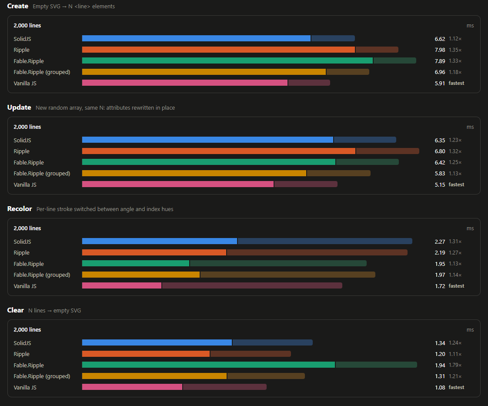
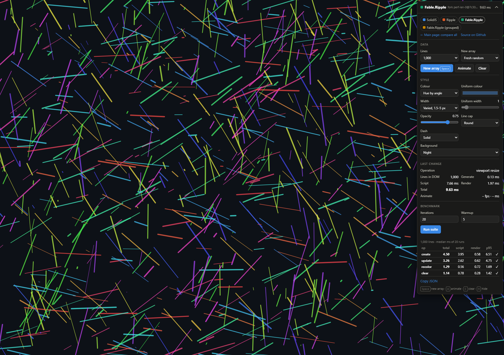

# drawSVGBench

A full-screen SVG line-drawing benchmark for **SolidJS**, **Ripple** (ripple-ts) and **Fable.Ripple** (F#),
with a **vanilla JS** page (plain DOM calls, no framework) as the baseline.

**Live demo: <https://goswinr.github.io/drawSVGBench/>** (see [Live demo](#live-demo) for its limits)



The core data structure is one `Float64Array` of random floats; every 4 floats are one line
(`x1 y1 x2 y2`, in pixels), at most 10% of the viewport width long. Each framework renders
`data.length / 4` `<line>` elements from it, with styling options, and replaces the array with a new
one to update the DOM. Every page uses the same data generator, the same style helpers and the same
timing code. Only the rendering layer differs.

## Results

One run of the compare page, 5,000 lines, 20 measured runs + 5 warmup per cell, uniform colour and
varied widths. Microsoft Edge 152, Windows 11, 20 cores, viewport 3832×1994 at 1×, production
build, 2026-09-24. Median total ms (script + render), with the ratio to the fastest in each row:

| Op                 | SolidJS 1.9.15 | Ripple 0.4.2   | Fable.Ripple   | Fable.Ripple (grouped) |
| ------------------ | -------------- | -------------- | -------------- | ---------------------- |
| Create             | **15.9**       | 19.2 (1.21×)   | 20.0 (1.26×)   | 16.1 (1.01×)           |
| Update             | 15.1 (1.11×)   | 16.9 (1.24×)   | 15.6 (1.14×)   | **13.6**               |
| Recolor            | 5.15 (1.23×)   | 4.64 (1.11×)   | **4.20**       | 4.28 (1.02×)           |
| Clear              | 2.64 (1.12×)   | **2.37**       | 3.56 (1.51×)   | 2.54 (1.08×)           |
| Geomean vs fastest | 1.11×          | 1.13×          | 1.21×          | 1.03×                  |

Both Fable.Ripple entries are built with Fable 5.17.2 against a fork with the changes described in
[Changes Fable.Ripple needed](#changes-fableripple-needed). Render time is about the same for all four
(1.9–2.0 ms on create, 2.6–2.7 ms on update, 2.5–2.6 ms on recolor, 0.5 ms on clear), so the
differences come from script time. Every run passed the DOM check.

Run-to-run noise is 10–30% at this size, so treat differences under about 20% as ties. What has held
up over earlier runs (headless Chrome, 1,000 to 100,000 lines):

- Create, update and recolor have no consistent winner.
- Idiomatic Fable.Ripple is the slowest at clear and create, because it runs 6 effects per line where
  Solid's and Ripple's compilers emit 1. With one hand-written effect per line (the grouped entry) it
  matches Solid and Ripple.
- Recolor is mostly the browser's style recalculation, not framework work.

The screenshot above is the compare page from a separate run at 2,000 and 20,000 lines.

The vanilla JS baseline was added after these runs and is not in the table or the screenshot yet.

## Quick start

Requires Node 20.19+ and the .NET 10 SDK (for the Fable compiler).

```sh
npm install          # also runs `dotnet tool restore` for Fable
npm run bench        # Fable release build + Vite production build, then opens the preview
```

| Script              | What it does                                                            |
| ------------------- | ----------------------------------------------------------------------- |
| `npm run dev`       | `dotnet fable watch` + Vite dev server (debug builds; not for numbers) |
| `npm run build`     | Fable in Release mode, then `vite build` into `dist/`                   |
| `npm run preview`   | Serves `dist/`                                                          |
| `npm run bench`     | `build` + `preview --open`                                              |
| `npm run typecheck` | `tsc --noEmit` over the TypeScript sources                              |
| `npm run deploy`    | `build`, then force-pushes `dist/` to the `gh-pages` branch             |

Pages:

- `/`: compare page. Runs the suite in each framework (one at a time, full-screen iframe) and charts the medians.
- `/solid/`, `/ripple/`, `/fable/`: each framework on its own, full-screen, with a control panel.
- `/fable-grouped/`: the Fable.Ripple app again, with one effect per line instead of one per
  attribute (see below).
- `/vanilla/`: no framework, the baseline (see below).

Keys on the framework pages: <kbd>Space</kbd> new array · <kbd>A</kbd> animate · <kbd>C</kbd> clear ·
<kbd>H</kbd> hide the panel. Add `?lines=20000` to the URL to start with a given count.



## Styling options

Colour mode (uniform / hue by angle / hue by length / hue by index), uniform colour, width mode
(varied / uniform), uniform stroke width, opacity, line cap, dash pattern (solid / dashed / dotted)
and background. Uniform mode sets `stroke` once on the parent `<g>`. The hue modes give every line
its own `stroke` attribute, so they also add work to every update. Varied width (the default) gives
every line its own `stroke-width` from 1.5 to 5 px, hashed from its index, so a line keeps its width
across updates: it costs work on create, but an update does not rewrite it.

## What is measured

| Op      | Work                                                                    |
| ------- | ----------------------------------------------------------------------- |
| Create  | Empty SVG → N `<line>` elements                                         |
| Update  | New random array, same N: existing lines' attributes rewritten in place |
| Recolor | Per-line `stroke` switched between hue-by-angle and hue-by-index        |
| Clear   | N lines → empty SVG                                                     |

- **Script**: the synchronous framework call (reactive graph + DOM mutation), timed with
  `performance.now()`. Solid 1.x and Fable.Ripple flush writes synchronously; Ripple calls are wrapped
  in `flushSync`. The vanilla page writes the DOM directly.
- **Render**: the browser's main-thread style, layout and paint for the frame that shows the change.
  It is measured from that frame's `requestAnimationFrame` callback to the first task after it. Waiting
  for vsync and off-thread rasterization are excluded.
- New arrays are generated before the timer starts, and each sample starts from a settled frame.
- After each op the DOM is checked against the data: line count, exact coordinates and the expected
  stroke and stroke-width on 5 lines. The compare page shows a ✗ for any mismatch.
- Every op/line-count cell has a wall-clock budget (default 20 s, setup included). When it is spent,
  the rest of the warmup is skipped and measuring stops after 3 samples (or after 1 once 3× the budget
  is gone). Such cells are marked `*`.
- The dev and preview servers send COOP/COEP headers, so `performance.now()` has 5 µs resolution
  instead of 100 µs.

Use the production build (`npm run bench`) for numbers, in a normal (headed) browser window with
nothing else busy. Dev builds include framework debug code; Fable's Debug build also enables
Fable.Ripple's hot-reload bookkeeping.

## How each framework renders

All three frameworks keep the whole array in **one** reactive source and render a list over `range(count)`,
where `count` is derived from `data.length / 4`. The index list is only rebuilt when the count
changes. Each `<line>` binds its 4 coordinates plus the optional per-line stroke and stroke-width
to the source.

| Framework                    | Source                                           | List                     | Per-line bindings                                                 |
| ---------------------------- | ------------------------------------------------ | ------------------------ | ----------------------------------------------------------------- |
| SolidJS ([solid/main.tsx](solid/main.tsx))    | `createSignal(Float64Array, { equals: false })`  | `<For>`                  | one render effect per line (the compiler groups the attributes)   |
| Ripple ([ripple/Stage.tsrx](ripple/Stage.tsrx)) | `track(Float64Array)`                            | keyed `@for`             | one render block per line (the compiler groups the attributes)    |
| Fable.Ripple ([fable/App.fs](fable/App.fs))  | `Var.createWith Signal.referenceEquals float[]`  | `Html.each`              | one `svgAttr.custom` effect per attribute (6 per line)            |
| Fable.Ripple (grouped), same file              | same                                             | same                     | one effect per line that writes all 6 attributes (`lineGrouped`)  |

The style fields are separate signals/tracked values/Vars in all three, so changing the width does
not wake the per-line bindings.

**The vanilla JS baseline** ([vanilla/main.ts](vanilla/main.ts)) has no reactive graph. It keeps an
array of `<line>` elements and writes them with `setAttribute`, doing what the compiled Solid and Ripple
code does and nothing more. An update rewrites the coordinates and only the strokes that changed.
Lines are added at the end, built before they are attached and inserted with one `append`; extra lines
are removed from the end, and a clear is one `textContent = ""`. A style change writes only the `<g>`
attributes that changed, and touches every line only when the colour or width mode changes. The
distance between a framework and this page is what the framework costs.

**Why two Fable.Ripple entries.** Solid's and Ripple's compilers turn an element's dynamic
attributes into one effect that re-evaluates them together and writes only the ones that changed.
Fable.Ripple.Dom has no compiler: each `svgAttr.custom` binding is its own effect, so the idiomatic
page creates, marks and tears down 6 reactive nodes per line where the others have 1. The grouped
page (`fable-grouped/index.html` loads the same `App.fs.js` with `data-variant="grouped"`) writes that
one effect by hand, with the public `Apply` + `Signal.effect` primitives. It shows how much of any
gap is the per-attribute binding style rather than the reactive core.

## Changes Fable.Ripple needed

The published results use a fork of [Fable.Ripple](https://github.com/fable-hub/Fable.Ripple), branch
[`perfClear`](https://github.com/goswinr/Fable.Ripple/tree/perfClear): four commits on top of
`cafa35a` (the 1.0.0-beta.4 release). They are not upstream yet. Without them the
F# page still works, but clearing or shrinking the list is quadratic (below).

| Commit    | Package          | Change                                                                                                                                                                                                  |
| --------- | ---------------- | ------------------------------------------------------------------------------------------------------------------------------------------------------------------------------------------------------- |
| `ee78536` | Fable.Ripple     | A teardown counts the dead entries it leaves in each source's observer list, and the list is swept only once they are half of it, so the total work is linear. Observer walks skip the dead entries. |
| `a2318ef` | Fable.Ripple     | The sweep check runs once, when the outermost flush, batch or disposal ends. A list cleared in one flush leaves every entry of the shared source dead, so the source drops its list without a pass. |
| `706f69d` | Fable.Ripple.Dom | `Html.each` clears with one `textContent = ""` when its parent holds only its rows and anchor, instead of one `removeChild` per row.                                                                  |
| `7c30aac` | Fable.Ripple     | Internal arrays are cleared with `length = 0` instead of `ResizeArray.Clear()`, which Fable compiles to `splice(0)`.                                                                                   |

The first three come with tests in the fork's suites.

The app itself needed no library changes, only three choices in [fable/App.fs](fable/App.fs):

- `Var.createWith Signal.referenceEquals` for the data. `Var.create` compares with structural
  equality, which would walk the whole array on every write.
- `optionalAttr`, a small `Apply` + `Signal.effect` helper, because `svgAttr.custom` always sets its
  attribute and the per-line `stroke` and `stroke-width` must be removed in uniform mode.
- `lineGrouped` for the grouped entry: the same public primitives, one effect for all six attributes.

### Why: clear was O(n²) in the published packages

With the published Fable.Ripple `1.0.0-beta.3` / Dom `1.0.0-beta.2`, removing rows from `Html.each`
gets quadratically slower when every row observes the same source, as here. The beta.4 release does
not change the code involved.

Clear, script time, headless Chrome 154, measured before `7c30aac`:

| Lines   | NuGet beta.3 | Fork, 1st commit | Fork, all 3 commits | Fork, grouped page | Solid | Ripple |
| ------- | ------------ | ---------------- | ------------------- | ------------------ | ----- | ------ |
| 1,000   | 11.7 ms      | 0.9 ms           | 0.5 ms              |                    |       |        |
| 10,000  | 1,666 ms     | 7.6 ms           | 5.0–5.7 ms          | 3.5 ms             | 2.8–3.4 ms | 2.5–2.9 ms |
| 20,000  | 6,628 ms     | 14.3 ms          | 9.5 ms              |                    |            |            |
| 50,000  | ~35 s        | 41 ms            | 27–37 ms            | 15–16 ms           | 16–22 ms   | 14–16 ms   |
| 100,000 | (minutes)    | 85 ms            | 48–53 ms            | 31 ms              | 29–33 ms   | 25–36 ms   |

Ranges are from separate runs on the same machine.

These runs had 5 bindings per line (before per-line widths). Cause: `Dom.keyedEach` disposes each
row's scope separately, and each `Scope.tearDown` compacted the shared source's whole observer list
(`Graph.compactObservers`): one pass over up to 5 × N observers for each of N rows. The single-pass
compaction in `tearDown` only covered nodes within one scope, not sibling row scopes. It affected
**Clear**, shrinking the line count, and the untimed reset before each **Create** sample; create,
update and recolor were not affected.

The remaining gap between the two Fable.Ripple entries is the per-attribute effects described above.

### Building against NuGet or the fork

If `./Fable.Ripple` exists (a clone of the fork with `perfClear` checked out, ignored by this repo's
git), the F# page is built
against its `src/` instead of the NuGet packages, and the page shows `fork <branch>@<commit>` as its
version. `npm run dev` then also recompiles on edits to the fork. To force the packages, set
`FABLE_RIPPLE=nuget` (e.g. `$env:FABLE_RIPPLE='nuget'; npm run build` in PowerShell).

## Live demo

<https://goswinr.github.io/drawSVGBench/> is the production build with the fork, published with
`npm run deploy`. GitHub Pages cannot send the COOP/COEP headers, so `performance.now()` is rounded
to 100 µs there instead of 5 µs. That is fine at thousands of lines, where each op takes
milliseconds; for small counts, or numbers to quote, run `npm run bench` locally.

## Layout

```
shared/lines.ts      data model: generator, drift, per-line stroke, dash patterns, BenchApp contract
shared/measure.ts    timing, stats, DOM verification, the suite runner
shared/harness.ts    full-screen stage + control panel + window.__bench (used by every page)
shared/frameworks.ts names and versions (versions injected by vite.config.ts)
solid/               SolidJS page
ripple/              Ripple page (Stage.tsrx + a bridge so the harness can write tracked state)
fable/               Fable.Ripple page (App.fs; Interop.fs binds the shared TS harness)
fable-grouped/       the same app with one effect per line (only an index.html)
vanilla/             vanilla JS page (no framework), the baseline
Fable.Ripple/        optional local clone of Fable.Ripple, used instead of NuGet when present
compare/ + index.html  compare page
scripts/deploy.mjs   pushes dist/ to the gh-pages branch
docs/                README images
```

`window.__bench` on each framework page exposes `run(config, onProgress)` and `check()`, so the suite
can also be driven from the console or an automation tool.

### Adding a framework

Write a page that implements `BenchApp` from [shared/lines.ts](shared/lines.ts): `mount(container, style)`,
plus `setData(Float64Array)` and `setStyle(style)`, which must commit the DOM before they return. Call
`startHarness(app)`. Then add its id to `FrameworkId` in [shared/lines.ts](shared/lines.ts), the page to
`FRAMEWORKS` in [shared/frameworks.ts](shared/frameworks.ts), and its version and `index.html` to
[vite.config.ts](vite.config.ts).
